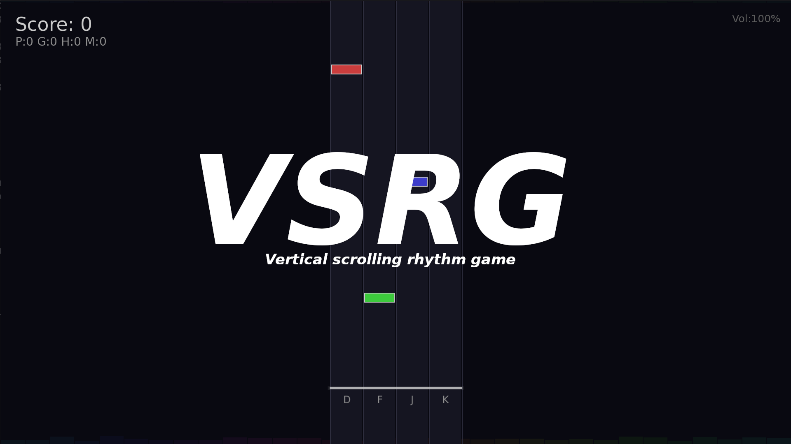

# EVERYTHING HERE WAS DONE BY AI AND FREE FOR COPY

# VSRG - Rhythm Game with Procedural Beatmap Generation

[🇷🇺 Русский](#русский) | [🇬🇧 English](#english)



---

## English

Vertical scrolling rhythm game like osu!mania / Piano Tiles with automatic note generation based on audio analysis.

### Features

- **Automatic beatmap generation** - audio analysis and note placement on beats
- **4 lanes** - D, F, J, K keys (fixed size, centered)
- **Hold notes** - long notes you need to hold
- **5 difficulty levels** - from VERY EASY to EXTREME
- **Auto-bot** - automatic playthrough
- **Visual effects** - particles, background pulse, dynamic equalizer
- **Rank system** - SS, S, A, B, C, D, F
- **Custom window size** - any resolution from 640x480 to 4K
- **Fullscreen mode** - native fullscreen support
- **Video support** - play with video files, video plays in background (requires FFmpeg)

### Build

Requires SFML 3.x:

```bash
# Arch Linux
sudo pacman -S sfml ffmpeg

# Compile
g++ -std=c++17 -O2 main.cpp -o vsrg -lsfml-graphics -lsfml-window -lsfml-system -lsfml-audio -pthread
```

### Usage

```bash
./vsrg <audio_or_video_file> [options]
```

#### Supported File Formats

Audio: WAV, OGG, FLAC (MP3 may work)
Video: MP4, MKV, AVI, WEBM, MOV, FLV (requires FFmpeg)

#### Options

| Option | Description |
|--------|-------------|
| `slow` / `1` | Slow speed (200) |
| `normal` / `2` | Normal speed (400) |
| `fast` / `3` | Fast speed (600) |
| `extreme` / `4` | Extreme speed (800) |
| `<number>` | Custom speed |
| `very-easy` / `ve` | Very easy difficulty |
| `easy` / `e` | Easy difficulty |
| `medium` / `m` | Medium difficulty (default) |
| `hard` / `h` | Hard difficulty |
| `extreme` / `x` | Extreme difficulty |
| `auto` | Enable auto-bot |
| `WIDTHxHEIGHT` | Window size (e.g. 1280x720) |
| `fullscreen` / `fs` | Fullscreen mode |

#### Examples

```bash
# Play with audio file
./vsrg music.wav

# Play with video file (video shows in background)
./vsrg video.mp4

# Fullscreen with video
./vsrg video.mp4 fullscreen hard

# Auto-bot with video
./vsrg music_video.mkv auto extreme fs
```

### Controls

| Key | Action |
|-----|--------|
| D, F, J, K | Hit notes (4 lanes) |
| ESC | Pause / Exit (on results screen) |
| +/- | Volume |
| R | Restart (on results screen) |
| SPACE | Start game |

### Difficulties

| Difficulty | Description |
|------------|-------------|
| VERY EASY | Minimal notes, no holds, for beginners |
| EASY | Few notes, rare holds |
| MEDIUM | Balanced |
| HARD | Many notes, double notes |
| EXTREME | Maximum notes, frequent doubles |

### Ranks

| Rank | Accuracy |
|------|----------|
| SS | 95%+ no misses |
| S | 90%+ |
| A | 80%+ |
| B | 70%+ |
| C | 60%+ |
| D | 50%+ |
| F | <50% |

### Video Background

When you load a video file:
1. Audio is automatically extracted using FFmpeg
2. Video plays in the background (dimmed)
3. Notes are generated from the audio track

Requirements: FFmpeg must be installed (`sudo pacman -S ffmpeg`)

---

## Русский

Вертикальная ритм-игра в стиле osu!mania / Piano Tiles с автоматической генерацией нот на основе анализа аудио.

### Возможности

- **Автоматическая генерация карт** - анализ аудио и создание нот под бит
- **4 дорожки** - управление клавишами D, F, J, K (фиксированный размер, по центру)
- **Hold-ноты** - длинные ноты, которые нужно зажимать
- **5 уровней сложности** - от VERY EASY до EXTREME
- **Авто-бот** - автоматическое прохождение
- **Визуальные эффекты** - частицы, пульсация фона, динамический эквалайзер
- **Система рангов** - SS, S, A, B, C, D, F
- **Любой размер окна** - от 640x480 до 4K
- **Полноэкранный режим** - нативная поддержка fullscreen
- **Поддержка видео** - играй с видеофайлами, видео на фоне (требуется FFmpeg)

### Компиляция

Требуется SFML 3.x:

```bash
# Arch Linux
sudo pacman -S sfml ffmpeg

# Компиляция
g++ -std=c++17 -O2 main.cpp -o vsrg -lsfml-graphics -lsfml-window -lsfml-system -lsfml-audio -pthread
```

### Запуск

```bash
./vsrg <аудио_или_видео_файл> [опции]
```

#### Поддерживаемые форматы

Аудио: WAV, OGG, FLAC (MP3 может работать)
Видео: MP4, MKV, AVI, WEBM, MOV, FLV (требуется FFmpeg)

#### Опции

| Опция | Описание |
|-------|----------|
| `slow` / `1` | Медленная скорость (200) |
| `normal` / `2` | Обычная скорость (400) |
| `fast` / `3` | Быстрая скорость (600) |
| `extreme` / `4` | Экстремальная скорость (800) |
| `<число>` | Своя скорость |
| `very-easy` / `ve` | Очень лёгкая сложность |
| `easy` / `e` | Лёгкая сложность |
| `medium` / `m` | Средняя сложность (по умолчанию) |
| `hard` / `h` | Сложная |
| `extreme` / `x` | Экстремальная |
| `auto` | Включить авто-бот |
| `ШИРИНАxВЫСОТА` | Размер окна (например 1280x720) |
| `fullscreen` / `fs` | Полноэкранный режим |

#### Примеры

```bash
# Играть с аудио файлом
./vsrg music.wav

# Играть с видео файлом (видео на фоне)
./vsrg video.mp4

# Полный экран с видео
./vsrg video.mp4 fullscreen hard

# Авто-бот с видео
./vsrg music_video.mkv auto extreme fs
```

### Управление

| Клавиша | Действие |
|---------|----------|
| D, F, J, K | Нажатие нот (4 дорожки) |
| ESC | Пауза / Выход (на экране результатов) |
| +/- | Громкость |
| R | Рестарт (на экране результатов) |
| SPACE | Начать игру |

### Сложности

| Сложность | Описание |
|-----------|----------|
| VERY EASY | Минимум нот, без холдов, для новичков |
| EASY | Мало нот, редкие холды |
| MEDIUM | Сбалансированно |
| HARD | Много нот, двойные ноты |
| EXTREME | Максимум нот, частые двойные |

### Ранги

| Ранг | Точность |
|------|----------|
| SS | 95%+ без миссов |
| S | 90%+ |
| A | 80%+ |
| B | 70%+ |
| C | 60%+ |
| D | 50%+ |
| F | <50% |

### Видео фон

Когда загружаешь видео файл:
1. Аудио автоматически извлекается через FFmpeg
2. Видео играет на фоне (затемнённое)
3. Ноты генерируются из аудио дорожки

Требования: FFmpeg должен быть установлен (`sudo pacman -S ffmpeg`)
